<div align="center">

# 👋 Olá, eu sou João Victor
### Backend Developer | Node.js & TypeScript Specialist


[](mailto:joaovictorr.info@gmail.com)
[](https://linkedin.com/in/joao-victorr)

</div>

---

## 🧠 O que me diferencia

```typescript
const joaoVictor = {
  code: ['TypeScript', 'JavaScript', 'SQL'],
  technologies: {
    backend: ['Node.js', 'Fastify', 'Prisma', 'PostgreSQL'],
    frontend: ['React', 'TailwindCSS'],
    tools: ['Docker', 'GitHub Actions', 'JWT'],
    architecture: ['Clean Architecture', 'SOLID', 'TDD']
  },
  mindset: 'Clean Code & Scalable Thinking',
  currentFocus: 'Aprendizado em Microsserviços e Contribuições Open Source'
};
```

💡 **Desenvolvedor Backend** com foco em código limpo, organizado e performático  
🔍 Busco sempre escrever soluções **manuteníveis, testáveis e seguras**  
🐳 Experiência com **Docker, CI/CD, autenticação JWT e boas práticas**  
📚 Evoluindo como **desenvolvedor full backend** com visão de arquitetura  

---

## 🔧 Stack Tecnológica

<div align="center">

<table>
<tr>
<td width="50%">

### Core Technologies


### Frameworks & Tools


### DevOps & Quality


</td>
<td width="50%">

### 📈 Linguagens mais usadas


</td>
</tr>
</table>

</div>

<details>
<summary><b>🚀 Minhas habilidades técnicas</b></summary>

### **Backend Developer**
* ⚙️ **Node.js + TypeScript** para APIs escaláveis e robustas
* ⚡ **Fastify** como framework performático
* 🧩 **Prisma ORM** com **PostgreSQL** para banco de dados moderno e tipado
* 🐳 **Docker** para ambientes isolados e previsíveis
* 🔐 **Autenticação JWT** e controle de permissões
* ✅ **Boas práticas** com SOLID, TDD e Clean Architecture

</details>

---

## 📘 Em Progresso

* 📌 Estudando padrões de arquitetura como DDD, BFF e microsserviços
* 🧪 Praticando TDD e testes de integração com frameworks modernos
* 🌍 Procurando oportunidades para contribuir com projetos Open Source
* 👥 Participando de comunidades e aprimorando soft skills

---

## 🚀 Projeto em Destaque

<div align="center">

[](https://github.com/joao-victorr/intranetBackend)

</div>

---

## 📊 GitHub Stats

<div align="center">
  
  
</div>

<div align="center">
  
</div>

---

## 🎯 Objetivos para 2024

```mermaid
graph TD
    A[🏗️ Estudo em Arquitetura Escalável] --> B[🔁 Aprendizado em Microsserviços]
    B --> C[🌍 Primeiras Contribuições Open Source]
    C --> D[👨‍🏫 Compartilhar Conhecimento]
    D --> E[🚀 Desenvolvimento de Soluções Escaláveis]
```



* 🔍 **Aprofundar** em arquitetura de sistemas e padrões avançados
* 🌍 **Colaborar** com comunidades e contribuir para o ecossistema
* 💼 **Atuar** como desenvolvedor backend sólido em ambientes profissionais
* 👥 **Crescer** como mentor, compartilhando o que aprendo no caminho

---

## 📫 Vamos conversar?

<div align="center">

[](https://linkedin.com/in/joao-victorr)
[](mailto:joaovictorr.info@gmail.com)
[](https://wa.me/5562996269258)

</div>

---

<div align="center">

### 💡 *"Código limpo não é escrito seguindo regras. Código limpo é escrito por programadores que se importam."*


</div>
