<div align="center">

# 👋 Olá, eu sou João Victor
### Backend Developer | Node.js & TypeScript Specialist


[](mailto:joaovictor@email.com)
[](https://linkedin.com/in/joaovictor)

</div>

---

## 🧠 O que me diferencia

```typescript
const joaoVictor = {
  code: ['TypeScript', 'JavaScript', 'SQL'],
  technologies: {
    backend: ['Node.js', 'Fastify', 'Prisma', 'PostgreSQL'],
    frontend: ['React', 'TailwindCSS'],
    tools: ['Docker', 'GitHub Actions', 'JWT'],
    architecture: ['Clean Architecture', 'SOLID', 'TDD', 'Microservices']
  },
  mindset: 'Clean Code & Scalable Solutions',
  currentFocus: 'Advanced System Architecture & Open Source'
};
```

💡 **Backend Developer** apaixonado por arquitetura escalável e robusta  
🔍 Escrevo código **limpo, testável e bem documentado**  
🏗️ Experiência com **Docker, CI/CD, autenticação, multi-tenant e microsserviços**  
📚 Sempre buscando evoluir como **desenvolvedor e arquiteto de soluções**  

---

## 🔧 Stack Tecnológica

<div align="center">

### Core Technologies


### Frameworks & Tools


### DevOps & Quality


</div>

<details>
<summary><b>🔥 Minhas especialidades</b></summary>

**Backend Excellence**
- ⚡ **Node.js + TypeScript**: APIs robustas e type-safe
- 🚀 **Fastify**: Performance e escalabilidade
- 🗄️ **Prisma + PostgreSQL**: Modelagem e queries otimizadas
- 🐳 **Docker**: Containerização e deploy consistente

**Arquitetura & Qualidade**
- 🏗️ **Clean Architecture**: Código organizando e testável
- ✅ **SOLID + TDD**: Boas práticas e testes automatizados
- 🔐 **JWT & Security**: Autenticação e autorização segura
- 🏭 **CI/CD**: Pipelines automatizados com GitHub Actions

</details>

---

## 🚀 Projetos em Destaque

<div align="center">

[](https://github.com/joaovictor/scalable-api-template)
[](https://github.com/joaovictor/microservices-architecture)

[](https://github.com/joaovictor/prisma-multi-tenant)
[](https://github.com/joaovictor/fastify-clean-api)

</div>

---

## 📊 GitHub Stats

<div align="center">
  
  
</div>

<div align="center">
  
</div>

---

## 🎯 Objetivos 2024

```mermaid
graph LR
    A[🏗️ Advanced Architecture] --> B[🔄 Microservices Mastery]
    B --> C[🌟 Open Source Contributions]
    C --> D[📚 Tech Leadership]
    D --> E[🚀 Scalable Solutions]
```



- 🔍 **Aprofundar** em arquitetura de sistemas e design patterns avançados
- 🌍 **Contribuir** ativamente com projetos open-source
- 🏢 **Ajudar empresas** a construírem backends seguros e performáticos
- 👥 **Mentorar** desenvolvedores iniciantes em Node.js e TypeScript

---

## 📫 Vamos conversar?

<div align="center">

[](https://linkedin.com/in/joaovictor)
[](mailto:joaovictor@email.com)
[](https://wa.me/5511999999999)

</div>

---

<div align="center">

### 💡 *"Código limpo não é escrito seguindo regras. Código limpo é escrito por programadores que se importam."*


</div>
